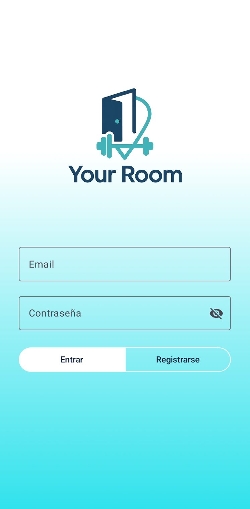
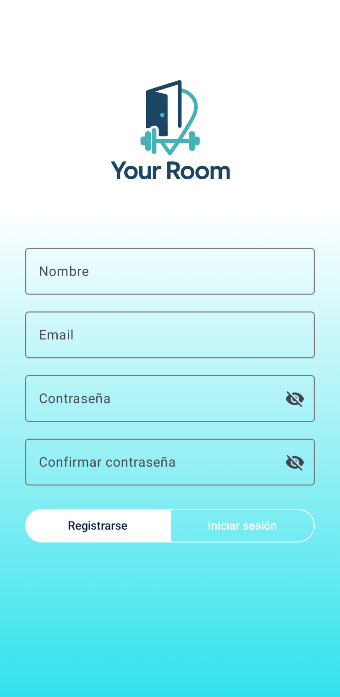
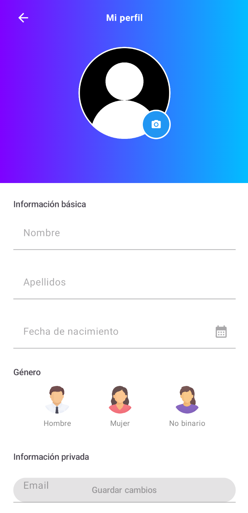
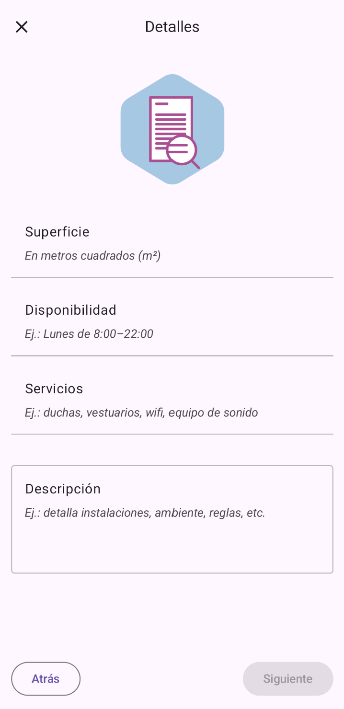
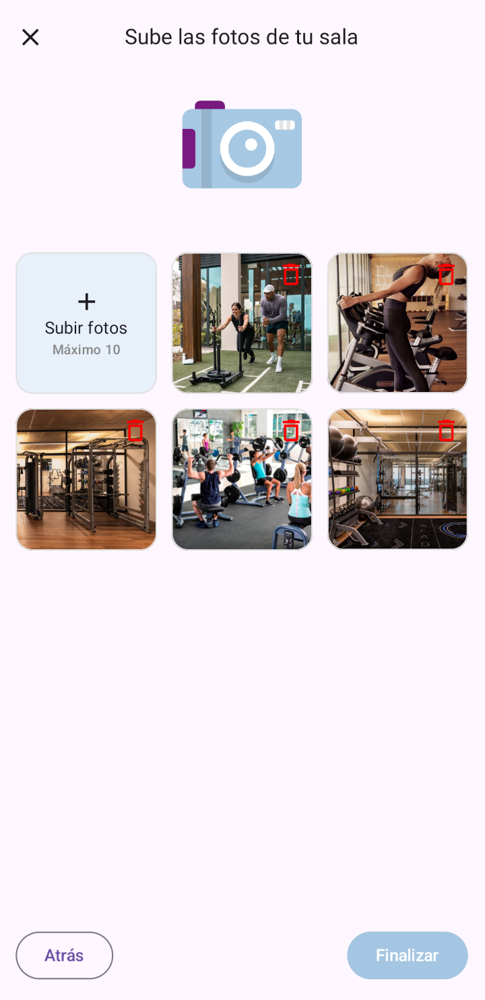
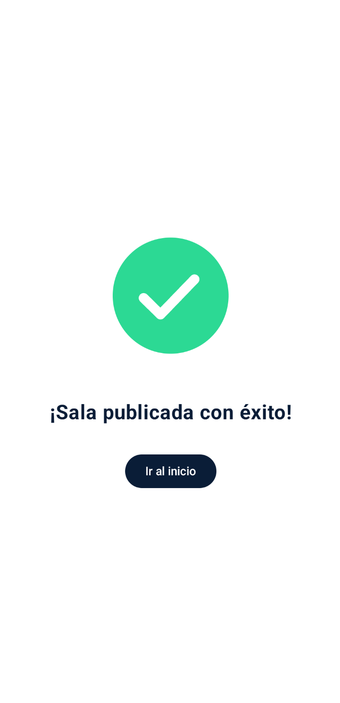
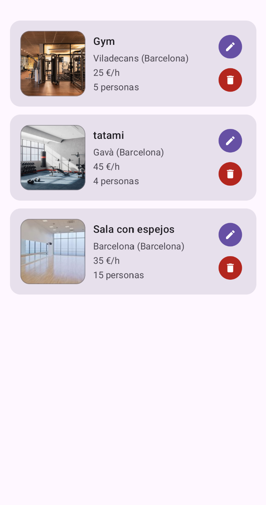

# YourRoomApp – Frontend Android (Jetpack Compose)

Aplicación Android para **YourRoom**, una plataforma pensada para entrenadores personales y usuarios que desean reservar cualquier tipo de sala, gimnasio, local o habitación para realizar actividades saludables y relacionadas con el cuidado y el bienestar de las personas.  
Este frontend consume la API del backend (Spring Boot + MySQL + JWT) y está construido con **Kotlin**, **Jetpack Compose**, **MVVM** y **Retrofit**.


### 🔐 Pantalla de Login
<p align="center">
  
</p>

### 📝 Pantalla de Registro
<p align="center">
  
</p>

### 👤 Pantalla de Perfil
<p align="center">
  
</p>


### 🏋️‍♂️ Pantalla de Publicar sala
<p align="center">
  
  
  
</p>

### ✅ Pantalla de éxito
<p align="center">
  
</p>

### 🧾 Pantalla Mis Salas
<p align="center">
  
</p>


---

## Tabla de contenidos

- [Arquitectura](#arquitectura)
- [Tecnologías](#tecnologías)
- [Características](#características)
- [Requisitos previos](#requisitos-previos)
- [Configuración del proyecto](#configuración-del-proyecto)
- [Compilación y ejecución](#compilación-y-ejecución)
- [Estructura de paquetes](#estructura-de-paquetes)
- [Gestión de dependencias (Version Catalogs)](#gestión-de-dependencias-version-catalogs)
- [Variables y entornos](#variables-y-entornos)
- [Buenas prácticas y calidad](#buenas-prácticas-y-calidad)
- [Resolución de problemas](#resolución-de-problemas)
- [Roadmap](#roadmap)
- [Licencia](#licencia)
- [Autor](#autor)

---

## Arquitectura

- **Patrón MVVM**: separación clara entre interfaz (UI), lógica de presentación (ViewModel) y acceso a datos (Repository).
- **Flujo de datos unidireccional**: la UI observa el estado expuesto por el ViewModel mediante `StateFlow` o `mutableStateOf`.
- **Comunicación con el backend** a través de **Retrofit** y **OkHttp**, usando DTOs definidos en `model/`.
- **Persistencia de sesión** con **DataStore**, para guardar token JWT y datos básicos del usuario.
- **Inyección de dependencias** con **Hilt** (configurada en `di/NetworkModule.kt`).
- **Navegación** entre pantallas con **Navigation Compose** (`navigation/`).
- **Un solo módulo `app`**, estructurado por funcionalidad (auth, perfil, salas, etc.), dentro del paquete `com.example.yourroom`.


---

## Tecnologías

- **Kotlin**, **Kotlin Coroutines/Flows**
- **Jetpack Compose** (Material 3)
- **Navigation-Compose**
- **Retrofit + OkHttp** (API REST)
- **Gson** (JSON parser para Retrofit)
- **Coil** (carga de imágenes)
- **DataStore** (token/ajustes)
- **Hilt** (inyección de dependencias — en ViewModels principales)
- **Material3 + Navigation-Compose** para diseño moderno y flujo entre pantallas.

---

## Características

- **Onboarding** de bienvenida con fondo degradado y **slider de progreso** (mostrado solo al primer inicio).
- **Login/Registro** con validación y consumo de API (JWT).
- **Perfil de usuario**: ver/editar datos y **subir imagen** (se envía al backend).
- **Gestión de salas (Mis Salas)**: listado, creación, edición, borrado y subida de fotos (con validaciones).  
- **Estados de UI**: loading, éxito, error con mensajes claros.
- **Soporte para distintos entornos** (dev / prod) vía `BuildConfig`.
- **Persistencia de sesión:** reconocimiento automático si el token JWT sigue activo.
- **Validaciones de campos:** tanto en login/registro como en formularios de salas y perfil.

> Nota: La disponibilidad exacta de features depende de la rama/versión del proyecto.

---

## Endpoints utilizados (resumen)

**Auth**
- `POST /api/auth/register`
- `POST /api/auth/login`

**Perfil**
- `GET /api/users/me`
- `PUT /api/users/me`
- `POST /api/users/me/photo`

**Rooms (Mis Salas)**
- `GET /api/rooms/mine`
- `POST /api/rooms`
- `PUT /api/rooms/{id}`
- `DELETE /api/rooms/{id}`
- `POST /api/rooms/{id}/photos`

> Todos los endpoints requieren autenticación mediante  
> `Authorization: Bearer <JWT>`.

---

## Clases clave

- **`LoginViewModel.kt`** — Controla el flujo de autenticación (login y registro) y gestión de tokens.
- **`UserProfileViewModel.kt`** — Gestiona los datos del perfil de usuario y la subida de imágenes.
- **`PublishSpaceViewModel.kt` / `PublishPhotosViewModel.kt`** — Manejan la creación y edición de salas, junto con la subida de fotos.
- **`UserRepository.kt` / `SpaceRepository.kt`** — Intermediarios entre el ViewModel y las llamadas a Retrofit.
- **`ApiService.kt`** — Define las interfaces Retrofit para Auth, Perfil y Rooms.
- **`UserPreferences.kt`** — Maneja la persistencia del token JWT mediante DataStore.
- **`NetworkModule.kt`** — Proporciona instancias de Retrofit, OkHttp e inyección Hilt.
- **`YourRoomApp.kt`** — Punto de entrada de la app con `NavHost` y configuración de tema.

---

## Requisitos previos

- **Android Studio** Ladybug Feature Drop (2024.2.2) o superior.
- **JDK 17**.
- **Gradle** wrapper incluido en el proyecto.
- Backend de **YourRoom** en ejecución y accesible (URL base).

---

## Configuración del proyecto

1. **Clona el repo**:
   ```bash
   git clone https://github.com/JaviSerrano1982/YourRoomApp.git
   cd YourRoomApp
   ```

2. **Configura la URL del backend** (baseUrl):
   - Opción A – por **BuildConfig** (recomendado):
     - En `app/build.gradle.kts`, dentro de cada `buildType`:
       ```kotlin
       buildTypes {
           debug {
               buildConfigField("String", "API_BASE_URL", "\"http://10.0.2.2:8080/\"")
           }
           release {
               buildConfigField("String", "API_BASE_URL", "\"https://api.tudominio.com/\"")
               isMinifyEnabled = true
               proguardFiles(
                   getDefaultProguardFile("proguard-android-optimize.txt"),
                   "proguard-rules.pro"
               )
           }
       }
       ```
     - En tu cliente de Retrofit:
       ```kotlin
       private const val BASE_URL = BuildConfig.API_BASE_URL
       ```

3. **Permisos/Network Security (solo si usas HTTP en local)**  
   Emulador (Android) para localhost del host: `http://10.0.2.2:8080/`.  
   Si pruebas en **dispositivo físico**, usa la IP de tu máquina.

4. **Keystore (release)**  
   Si vas a generar APK/AAB de release, configura tu keystore **fuera** del repo y usa variables locales.

---

### 🔑 Configuración de Firebase

La aplicación utiliza **Firebase Storage** para subir y gestionar fotos de perfil y de salas.

Por motivos de seguridad, el archivo `google-services.json` (con las credenciales del proyecto Firebase)
no está incluido en este repositorio.

Si deseas ejecutar la aplicación localmente:

1. Crea un proyecto propio en [Firebase Console](https://console.firebase.google.com/).
2. Añade una app **Android** con el mismo identificador del paquete: **com.example.yourroom**.
3. Descarga el archivo `google-services.json` que te proporciona Firebase.
4. Colócalo en la ruta:  **app/google-services.json**.
5. Asegúrate de no subir ese archivo al repositorio (ya está en `.gitignore`).

> 💡 Si solo deseas revisar el código, no es necesario configurar Firebase.
> La app compila correctamente sin el archivo, aunque las funciones de subida de imagen no estarán activas.


## Compilación y ejecución

- **Debug en emulador**:
  - Backend local en el host: `http://10.0.2.2:8080/`
  - Pulsa ▶ en Android Studio sobre el módulo `app`.

- **Desde terminal**:
  ```bash
  ./gradlew clean assembleDebug
  ./gradlew installDebug
  ```

- **Release**:
  ```bash
  ./gradlew bundleRelease
  ```
  El AAB se genera en `app/build/outputs/bundle/release/`.

---

## Estructura de paquetes

```
app/
├─ manifests/                      — Manifest del módulo: permisos, activities, network security, etc.
└─ kotlin+java/
   └─ com.example.yourroom/        — Paquete raíz principal de la app
      ├─ datastore/                — Persistencia ligera (DataStore) para token JWT y preferencias de usuario
      ├─ di/                       — Inyección de dependencias con Hilt (módulos de red y repositorios)
      ├─ location/                 — Lógica de localización (municipios, provincias, etc.)
      ├─ model/                    — Modelos y DTOs de peticiones/respuestas del backend
      ├─ navigation/               — Gráfico de navegación, rutas y control del flujo entre pantallas
      ├─ network/                  — Configuración de Retrofit, OkHttp e interceptores de autenticación
      ├─ repository/               — Repositorios que gestionan el acceso a datos (API, DataStore, etc.)
      ├─ ui/
      │  ├─ components/            — Composables reutilizables (botones, campos, layouts, etc.)
      │  ├─ screens/               — Pantallas principales (login, registro, perfil, publicar sala, etc.)
      │  └─ theme/                 — Tema Material 3 (Color.kt, Theme.kt, Type.kt)
      └─ viewmodel/                — ViewModels MVVM: lógica, validación y estado de cada pantalla

```

---


## Gestión de dependencias (Version Catalogs)

El proyecto utiliza **Version Catalogs** (`gradle/libs.versions.toml`) para centralizar versiones y dependencias.

Principales librerías:
- **Jetpack Compose** (Material 3, Navigation)
- **Retrofit + OkHttp + Gson** (consumo de API REST)
- **Hilt** (inyección de dependencias)
- **Coil** (carga de imágenes)
- **Kotlin Coroutines/Flow** (asincronía y estado)

> Las versiones exactas y módulos pueden consultarse en  
> `gradle/libs.versions.toml` y `app/build.gradle.kts`.


---

## Variables y entornos

- **JWT**: se almacena de forma segura en **DataStore** o similar.
- **BASE_URL**: configurada en `BuildConfig` según entorno (`debug` usa `http://10.0.2.2:8080/`, `release` usa dominio remoto).
- **No subas secretos** al repo. Añade a `.gitignore`:
  ```
  *.keystore
  *.jks
  local.properties
  your_keystore_passwords.txt
  ```
- Si incluyes ejemplos, usa **placeholders** (p. ej. `http://10.0.2.2:8080/`).

---

## Buenas prácticas y calidad

- **Formateo**: Ktlint/Spotless (opcional).
- **Tests**:  
  - Unit tests para ViewModels y UseCases.  
  - Fakes/Mocks para repos/servicios.
- **Errores/Estados**: usar un `sealed class Result` (`Loading/Success/Error`).
- **Accesibilidad**: contentDescription en imágenes y tamaños adaptativos.
- **Rendimiento**: evitar recomposiciones innecesarias (usar `remember`, `derivedStateOf`).

---

## Resolución de problemas

- **HTTP en emulador**: usa `10.0.2.2` como host.  
- **CORS/Policies**: el frontend Android no tiene CORS, pero si el backend está detrás de proxy/HTTPS, revisa certificados para dispositivos físicos.
- **Timeouts**: sube `read/connect timeout` en OkHttp durante desarrollo si el backend está en local.
- **Imagen de perfil**: asegúrate de enviar el **multipart** correcto al endpoint del backend.

---

## Roadmap

- [ ] Internacionalización (i18n) y mensajes localizados (ES/EN).  
- [ ] Validaciones accesibles y mensajes de error más descriptivos.  
- [ ] Estado offline y caché básica para perfil y salas.  
- [ ] Tests de UI (Compose UI Test) y unit tests en ViewModels.  
- [ ] Modo oscuro completo y temas dinámicos (Material You).  
- [ ] Búsqueda y filtro avanzado de salas públicas (por ubicación/mapa).  
- [ ] Sistema de reservas y disponibilidad horaria.  
- [ ] Notificaciones push (confirmaciones y recordatorios).  


---

## Licencia

Proyecto de uso **académico/demostrativo**. Todos los derechos reservados por el autor.

Distribuido bajo la licencia [MIT](./LICENSE).  
Consulta el archivo LICENSE para más información.

---

## Autor

**Javier Serrano**  
Desarrollador de apps multiplataforma  
[GitHub](https://github.com/tu-usuario) · [LinkedIn](https://linkedin.com/in/javier-serrano-jiménez-aaba69117)
